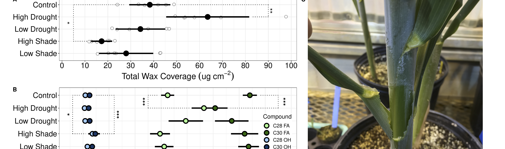

# Wax Bloom Dynamics on *Sorghum bicolor*

## Overview
This study investigates the modulation of epicuticular wax bloom dynamics in *Sorghum bicolor* under various environmental stressors, including drought and simulated shade. Using a combination of gas chromatography-mass spectrometry (GC-MS), RNA-seq, and photographic analysis, we explored the molecular and genetic mechanisms underlying these responses. The results reveal that wax bloom quantity and composition are significantly influenced by environmental conditions, and the study presents a draft signaling pathway associated with wax production. Additionally, a smartphone-based visual phenotyping method was developed to monitor wax development, showing potential for future high-throughput gene screening.

## Data
The dataset includes GC-MS measurements of wax abundance and composition across different experimental conditions, RNA-seq gene expression profiles from light induction experiments, and photographic data capturing wax bloom development. These data facilitate the replication of findings and the exploration of wax dynamics using various analysis techniques described.

## R Code
The R scripts provided enable the recreation of statistical analyses such as PCA on the photographic data. The scripts also support differential gene expression analysis and visualization of RNA-seq data, assisting in further experimentation on wax bloom dynamics.

## Results
Our findings indicate that high-intensity drought and light treatments significantly impact wax bloom production, with increased wax load under drought conditions and decreased load under high-intensity simulated shade. The study identifies key genes potentially involved in light-mediated wax production, and a smartphone-based method effectively monitored wax dynamics, revealing differences between experimental groups. This system shows promise for scalable phenotyping in gene studies.

## Contribution to the Scientific Community
This investigation advances the understanding of drought tolerance mechanisms in *Sorghum bicolor*, with implications for crop engineering. The smartphone-based phenotyping tool offers a novel approach to monitor and quantify wax bloom dynamics efficiently. The draft signaling pathway for wax induction provides a framework for future studies targeting the genetic regulation of epicuticular waxes.

## License
This project is licensed under the MIT License - see the `LICENSE.md` file for details.

## Citation
If you use the data or code from this project in your research, please cite it as follows:
> Larson, M., Hampton, M., Busta, L., et al. (2024). Wax bloom dynamics on *Sorghum bicolor* under different environmental stresses reveal signaling modules associated with wax production. DOI: https://doi.org/10.1101/2024.10.10.617702.

For any further inquiries, please open an issue or contact the repository maintainers directly.
